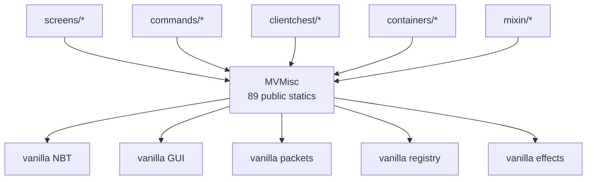
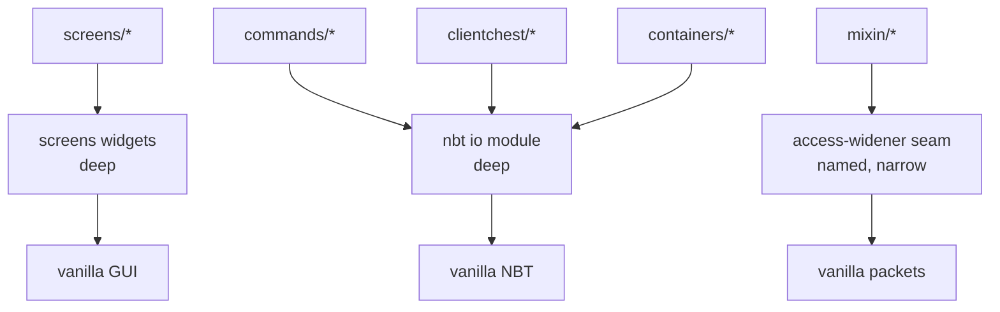

# Composite audit — NBT-Editor, 2026-09-14

Three passes over the whole tree, merged: a thermo-nuclear code quality review (structure and
maintainability), an architecture review (module depth and seams), and a ponytail audit
(over-engineering and deletable volume). Nothing here is implemented yet.

**State at audit.** Branch `local` at `9638a66`, 105 commits ahead of `main`, 460 files changed
(+19100 / −19917). 369 Java files, 34,425 lines under `src/`. `./gradlew build` is **green** on
JDK 25 (verified locally, exit 0). `:test` reports `NO-SOURCE` — there are zero tests.
Knowledge graph refreshed before the audit: 4553 nodes, 14161 edges, 350 communities, health OK.

---

## The spine: the migration finished, the machinery did not

Every section below keeps arriving at one fact, so it belongs at the top.

The 26.2 migration collapsed the premise that this codebase was built on. `nbteditor_1.17` is
deleted. `settings.gradle` declares no second module. `Version.java` no longer gates a single
behaviour — it is now just a data-version lookup table, and its only two call sites ask for a
display string. Nothing in `src/` branches on game version any more.

The *machinery* built to serve that premise is still standing: 27 classes in `multiversion/`,
`TextInst`, `IdentifierInst`, `Reflection`, and a class literally named
`MVTexturedButtonWidget_1_20_2`. These were version-drift adapters. There is no longer a
version to drift from.

This is simultaneously the largest structural-quality problem (a 494-line, 89-method god class
that is the single hottest file in the branch), the largest architectural problem (the widest
shallow module in the repo), and the largest deletable volume. Treat it as one piece of work,
not three.

---

## Part 1 — Thermo-nuclear: structural quality

Ranked by structural damage, not line count.

### T1. `ClientChest.java` — eight near-identical async methods · **blocker-grade**

`clientchest/ClientChest.java`, 849 lines, 91 conditionals.

Four `*AllPages` methods (`unloadAllPages` L301, `importAllPages` L370, `updateAllPages` L434,
and the page-scan inside each) and four `*Page` methods (`unloadPage` L339, `importPage` L407,
`updatePage` L475, `discardPage` L507) each hand-roll the identical sequence:

```
startUncachedProcessing(page) → new CompletableFuture → new Thread(...) →
  lock.{read|write}().lock(page) → try { work } catch { LOGGER.error; completeExceptionally }
  finally { unlock; finishUncachedProcessing } → thread.start() → return future
```

The `*AllPages` variants additionally each re-implement the same directory walk, the same
`page[0-9]+\.nbt` regex, the same `Integer.parseInt(name.substring(...))`, the same
`page >= cache.getPageCount()` guard, and the same `Exception toThrow` suppressed-exception
aggregation. The only things that vary are: read vs. write lock, the thread-name suffix, the
per-page predicate, and the one-line body.

**Code judo.** Two private helpers make all eight call sites one-liners:

- `perPage(int page, boolean write, String op, ThrowingFunction<Integer, T> body)`
- `allPages(boolean write, String op, IntPredicate selector, ThrowingIntConsumer body)`

That is roughly −200 lines, and — more importantly — it makes the locking discipline and the
uncached-processing bookkeeping impossible to get wrong in a ninth method, because there is
only one copy of it. Right now a new bulk operation means correctly re-deriving lock
acquisition, `finally`-block ordering, and exception aggregation from scratch.

**Recommendation strength: Strong.** This is the highest-value change in the audit.

### T2. `misc/MixinLink.java` — static god grab-bag · **blocker-grade**

356 lines, 37 conditionals, **21 commits on this branch** (hot spot #2).

One static class holds ~13 unrelated concerns: a click-event registry (`events`), a screenshot
target file, tooltip measurement and rendering, a hidden-exception handler set, a chat-limit
warning renderer, special-number NBT parsing, container mouse-click and key-press handling, a
written-book cache, crashable-task bookkeeping, a new-tooltip weak set, main-thread identity,
an item-being-rendered map, and a component-changes set.

Almost all of it is *mutable global state*, and much of it is thread-keyed
(`Set<Thread> hiddenExceptionHandlers`, `Set<Thread> specialNumbers`,
`Map<Thread, ItemStack> ITEM_BEING_RENDERED`, `WeakHashMap` caches). Thread-keyed globals are a
signal that a value is being smuggled past a call stack the mixin cannot change — which is a
legitimate constraint, but it should be one named mechanism used deliberately, not a
convention repeated ad hoc in six places.

The name is the tell: `MixinLink` means "the place mixins reach into", which is not a
responsibility. It is a namespace.

**Remedy.** Split by concern into the packages that already own each one — tooltip rendering to
`screens/`, NBT special-number parsing to the NBT layer, container input to
`screens/containers/`. Where thread-local smuggling is genuinely required, give it one typed
helper instead of six bare collections.

**Recommendation strength: Strong.** It is the second-hottest file on the branch; the cost of
leaving it compounds.

### T3. `multiversion/MVMisc.java` — 89 public static methods · **blocker-grade**

494 lines, **24 commits on this branch** (hot spot #1), 136 graph edges (god node #2).

89 unrelated public statics: resource loading, command argument factories, button factories,
keyboard repeat, char validation, NBT file IO (8 overloads), status effects, book contents,
toasts, vertex helpers, tick delta, equipment slots, registry callbacks, profiler access,
potion components, RGB scaling, creative screen construction, packet field accessors, and a
block of keyboard-shortcut predicates (`hasShiftDown`, `isCopy`, `isPaste`, `isCut`,
`isSelectAll`).

Nearly every method body is one line delegating to vanilla. See Part 2 for why this is also the
architectural centre of gravity.

**Recommendation strength: Strong**, but sequenced after T1/T2 — it is wide and mechanical, and
it is safest once the migration settles.

### T4. `util/MainUtil.java` — the second grab-bag

499 lines, 44 public statics, 147 graph edges (god node #1), 19 commits.

Item saving, creative-stack clicking, logo rendering, string wrapping, colorize/stripColor, dye
colour mapping, NBT data-fixer wrappers, int predicates, date formatting, image scaling, mouse
position, matrix mapping, future merging, text-field mutation. Same pathology as T3.

Two overlapping grab-bags is worse than one, because "where does this helper go" now has no
answer. `MainUtil.readNBT(InputStream)` and `MVMisc.readNbt(InputStream)` both exist.

**Recommendation strength: Worth exploring** — lower heat than T3, same fix.

### T5. File size: two files at the 1k line wall

| File | Lines | Conditionals |
|---|---|---|
| `screens/widgets/MultiLineTextFieldWidget.java` | 978 | 102 |
| `screens/widgets/FormattedTextFieldWidget.java` | 892 | 81 |

Neither crossed 1000 on this branch, so neither is a regression — but both are one feature away,
and both have an obvious decomposition already sitting inside them:

- `MultiLineTextFieldWidget` contains `FindAndReplaceWidget` as a private inner class,
  L44–L226 (~185 lines) with its own static state (`findValue`, `replaceValue`, `regex`), its
  own regex matching, and its own input handling. It is a separable widget.
- `FormattedTextFieldWidget` nests three deep: `FormattedTextFieldWidget` →
  `InternalTextFieldWidget` (L44) → `EventEditorWidget` (L45), plus two enums and a callback
  interface. `EventEditorWidget` (L45–L211, ~165 lines) is an independent dialog.

Extract both before either file grows again.

**Recommendation strength: Worth exploring.**

### T6. Container IO read/write plumbing repeated across 13 adapters

`containers/` — `ContainerIO<T>` has 13 implementations that each re-implement the same
`NBTManagers.ITEM.deserializeOrElse(...)` read loop and the same
`clear() → iterate → nbte$serialize(true) → add()` write loop, varying only in how slots are
addressed (ordered list, slot-key list, named keys, component).

Unlike T1 this is *near*-duplication across a real abstraction, so the fix is to push the
plumbing down into `ContainerIO` default methods and leave each adapter with only its slot
addressing. See A4 — this is a good seam being under-used, not a bad one.

**Recommendation strength: Worth exploring.**

### T7. Zero tests, and the approval bar

`build.gradle` ends with `test { exclude '**/*' }`; `.gitignore` excludes `src/test/`; the
build confirms `:test NO-SOURCE`. Verification is "compile, then exercise the screen in a dev
client".

Stated plainly: **every refactor recommended above would be performed without a safety net.**
T1 in particular rewrites concurrent file IO under a partitioned read/write lock. That is the
single most dangerous thing in this codebase to change blind, and it is also the change with
the best payoff.

`ClientChest`'s page format is plain NBT on disk and its locking is in-process. A small JVM-only
test that exercises `perPage`/`allPages` against a temp directory needs no Minecraft client. It
would not test the mod; it would test the one mechanism being deduplicated. That is enough.

**Recommendation strength: Strong** — and it should land *before* T1, not after.

### T8. CI cannot build this branch · **confirmed defect**

`.github/workflows/build.yml` pins `java-version: '21'`. `build.gradle` sets
`options.release = 25` and `sourceCompatibility/targetCompatibility = VERSION_25`.

javac on JDK 21 cannot target release 25. The workflow will fail at `:compileJava`. Locally the
build passes only because SDKMAN supplies `25.0.4-tem`.

`CLAUDE.md` still describes this project as "Java 16 bytecode target built on JDK 21", so the
workflow was consistent with the documented intent and the *build file* is what moved.

**Fix:** bump the workflow to JDK 25 (one line). **Recommendation strength: Strong**, and it is
the cheapest item in the whole audit.

---

### T9. `PartitionedLockImpl` convoys: contention on one partition stalls all of them · **confirmed defect**

*Found while implementing item 4, not during the original three passes.*

`PartitionedLockImpl.lock(int)` blocks on the partition lock while still holding the global lock:

```java
globalLock.lock();
try {
    Lock lock = locks.get(partition);
    if (lock == null) lock = new ReentrantLock(true);
    lock.lock();               // blocks here, still inside globalLock
    locks.put(partition, lock);
} finally {
    globalLock.unlock();
}
```

A thread waiting on partition 1 therefore holds `globalLock` for the whole wait, and every other
thread — whatever partition it wants — blocks at `globalLock.lock()`. The partitioning silently
degrades to a single global lock the moment any one partition is contended.

**Demonstrated**, not inferred: with partition 1 held by one thread and merely *contended* by a
second, a third thread could not acquire partition 99 within a full second; it proceeded only
after partition 1 was released. The committed suite's
`writeLocksOnDifferentPartitionsRunConcurrently` passes because it exercises the *uncontended*
case, which is the only case that actually partitions.

**Effect in practice:** two `ClientChest` operations on the same page serialize every other page's
IO behind them — `importAllPages` and `updateAllPages` are exactly the callers that make this
likely.

**Fix:** acquire or create the partition's `Lock` under `globalLock`, release `globalLock`, then
block on the partition lock outside it. The `locks.remove(partition)` in `unlock` has to become
reference-counted for that to be safe, since the entry can no longer be removed by the last
unlocker without racing an incoming waiter.

**Recommendation strength: Strong**, but it is a correctness change, not a restructuring — fold it
into item 5 rather than shipping it blind. Out of scope for the ponytail pass by construction.

**Fixed (2026-09-15), shipped separately from item 5**, because a refactor that carries a
behaviour change loses its safety net. Three edits to `PartitionedLockImpl`:

1. `lock` resolves the partition's `Lock` under the global lock, releases it, *then* blocks. The
   convoy is gone.
2. `unlock` no longer removes the map entry. Removal was what forced the convoy design in the
   first place, and it hid a second defect (below).
3. `unlockAll` no longer calls `locks.clear()`. Entries are now per-partition locks that outlive
   any one acquisition. No entry can appear between `lockAll` and `unlockAll`, since adding one
   requires the global lock, so the set stays balanced.

**Second defect found while fixing this one.** `unlock` did `locks.remove(partition).unlock()`,
so the *second* release of a re-entrantly held partition dereferenced null. The same removal also
raced two waiters on one partition: the first to release deleted the entry the second was parked
on, so the second's release threw `NullPointerException`. Neither was in the original three
passes. Both are covered now.

**Coverage.** `PartitionedReadWriteLockTest` is 10 tests, including a contention stress test
(8 threads, 200 iterations, 4 partitions) asserting mutual exclusion directly. Verified by
mutation: restoring the old `unlock` fails 3 tests, one of which passed against the original
code. Suite run 18 times without a flake.

---

## Part 2 — Architecture: depth, seams, and leverage

Vocabulary per `/codebase-design`: **module**, **interface**, **depth**, **seam**, **adapter**,
**leverage**, **locality**.

> No `CONTEXT.md` and no `docs/adr/` exist, though `CLAUDE.md` promises both "created lazily".
> There is therefore no ADR for any candidate below to contradict. See A6.

### A1. `MVMisc` is the widest shallow module in the repo

**Files:** `multiversion/MVMisc.java`, and its 136 incident graph edges.

**Problem.** A module is shallow when its interface is nearly as complex as its implementation.
`MVMisc` presents an 89-method interface over ~400 lines of body — most methods are a single
delegating line. A caller gets almost no behaviour per unit of interface learned, and there is
nothing behind the seam to vary: there is one game version.

**Deletion test.** Delete `MVMisc`. Does complexity concentrate elsewhere, or just move? It
moves — each call site inlines the one line `MVMisc` was forwarding. Complexity never
concentrated here, which is the definition of a pass-through.

**Solution.** Not "delete `MVMisc`" in one swing. Partition its 89 methods by what they
actually are:

1. **Pure delegations** (`getContent`, `value`, `result`, `parseNbt`, the shortcut predicates) —
   inline to the vanilla call.
2. **Genuinely deep helpers** (`addBlockEntityNbtWithoutXYZ`, `getBoatItem`, `scaleRgb`,
   `withDefaultRegistryManager`, the 8 NBT file-IO overloads) — these hold real behaviour.
   Move them to the package that owns the concept: NBT IO to the NBT layer, RGB to a colour
   helper, registry scoping to `DynamicRegistryManagerHolder`.
3. **Access-widener reach-throughs** (packet field accessors, `setPreviousCursorStack`) — these
   exist because the field is inaccessible, not because the version varies. They are a real
   seam; name it as one.

**Wins.** Locality: today, a change to NBT file IO lands in a file that is also about buttons
and toasts, and that file has taken 24 commits this branch — every unrelated edit competes for
the same merge surface. Leverage: after the split, each destination module gains real depth
instead of one module hosting 89 shallow entries.

**Before**



**After**



**Recommendation strength: Strong.**

### A2. `TextInst` and `IdentifierInst` — mixed modules at a dead seam

**Files:** `multiversion/TextInst.java` (121 lines), `multiversion/IdentifierInst.java` (30).

`IdentifierInst.of(String)` is `Identifier.parse(id)`. `IdentifierInst.of(ns, path)` is
`Identifier.fromNamespaceAndPath(ns, path)`. `TextInst.of/literal/translatable/copy/
copyContentOnly` are one-line forwards to `Component` methods. Pure pass-throughs at a seam
where nothing varies.

But `TextInst` is not uniformly shallow. `fromString`, `fromSNbt`, `fromJson`, `toNbt`, and
`jsonOps` hold ~80 lines of real behaviour: they unify three serialization formats behind a
single error contract, converting `CommandSyntaxException` / `NbtFormatException` /
`JsonParseException` into one `IllegalArgumentException` with suppressed causes. That is a
**deep** module and it should survive.

**Solution.** Split by depth, not by file. Delete the trivial delegations; keep the
format-unification core (it arguably belongs next to `util/TextUtil`, which its own javadoc
already points callers toward). `IdentifierInst.isValid` has one caller and a real try/catch —
fold it into that caller or into the identifier-adjacent helper.

**Call-site volume** (mechanical but wide — sequence it deliberately):

| Symbol | Call sites |
|---|---|
| `TextInst.translatable(` | 354 |
| `TextInst.of(` | 87 |
| `TextInst.literal(` | 81 |
| `IdentifierInst.of(` | 61 |
| `TextInst.copy(` | 9 |
| `IdentifierInst.isValid(` | 1 |
| `TextInst.copyContentOnly(` | **0** |

`copyContentOnly` has zero callers — delete outright.

**Recommendation strength: Worth exploring** on the trivial delegations (high churn, low risk,
but 592 edits); **Strong** on deleting `copyContentOnly` and on keeping the deep core.

### A3. One-adapter seams

> *One adapter means a hypothetical seam. Two adapters means a real one.*

- **`MVTexturedButtonWidget_1_20_2`** — one caller (`MVMisc.java:155`), and the class name
  asserts a game version this repo no longer supports. Either the name is wrong or the class is.
- **`Reflection`** (67 lines, a Guava `Cache`, a `FieldReference` wrapper) — down to **2** call
  sites after the branch's cleanup work, both in `server/`:
  `NBTEditorServer.java:150` and `ServerMixinLink.java:57`. A Guava-cached class loader for one
  class lookup is a cache with a maximum population of one.
- **`util/ClassMap`** (30 lines) — one caller (`screens/nbtfolder/NBTFolder.java`). It is a
  `HashMap` plus a linear `isAssignableFrom` scan. Fine as a private helper inside `NBTFolder`;
  it does not need to be a public utility type.

**Recommendation strength: Strong** (each is small and self-contained).

### A4. The seams that *are* real — invest here

This codebase has good architecture, and it is worth naming so the cleanup does not damage it:

| Module | Adapters | Verdict |
|---|---|---|
| `ContainerIO<T>` | 13 | Real seam. Genuinely varying slot-addressing strategies. |
| `ItemReference` | 5 | Real seam. Hand / server / inventory / container / client-chest. |
| `LocalNBT` | 3 | Real seam. `LocalItemStack`/`LocalBlock`/`LocalEntity` diverge substantially — `renderIcon()` alone has three unrelated implementations. |
| `TagReference<T,O>` | 9 | Real seam, but see T6-style duplication in the implementations. |

These four are where depth already lives. The T6 remedy — pushing repeated read/write plumbing
into `ContainerIO` default methods — *increases* the depth of an already-good seam, which is the
opposite of the `MVMisc` situation and should not be confused with it.

**Recommendation strength: Strong** for `ContainerIO` default-method consolidation.

### A5. No domain glossary, no ADRs

The domain vocabulary is real, consistent, and entirely unwritten: *page*, *page load level*,
*data version* / *data version status*, *container IO*, *tag reference*, *local NBT*, *NBT
reference*, *uncached processing*. An agent or a new contributor reconstructs all of it from
source every time.

`CLAUDE.md` says `CONTEXT.md` and `docs/adr/` are "created lazily". Neither exists. This audit
would have been materially cheaper with them.

**Recommendation strength: Worth exploring** — cheap, and it compounds with every future agent
session.

### A6. `CLAUDE.md` actively misleads

Four claims that are now false, in the file agents read first:

| `CLAUDE.md` says | Actually |
|---|---|
| "Two modules: root and `nbteditor_1.17`" | `nbteditor_1.17` deleted; `settings.gradle` declares no modules |
| "Java 16 bytecode target built on JDK 21" | `options.release = 25`, `VERSION_25` |
| "A single jar supports 1.17 through 1.21" | `minecraft_version=26.2` |
| "`Version.java` gates behaviour" | `Version.java` has no gating left; 2 call sites, both display strings |
| "`mergeRefmapJson` and `jar` tasks merge the 1.17 module" | no such task in `build.gradle` |

The instruction "Never call a Minecraft API directly when an `MV*` equivalent exists" is now
actively counterproductive — it tells agents to preserve the layer this audit recommends
dismantling.

**Recommendation strength: Strong.** Correct it before any of the refactors below, or the next
agent session will re-create what you delete.

---

## Part 3 — Ponytail: what to cut

Ranked biggest cut first. Correctness, security, and performance are out of scope for this pass.

```
delete: ClientChest's eight hand-rolled async methods. Two private helpers (perPage, allPages). [clientchest/ClientChest.java:301-533]
yagni:  the multi-version adapter layer — 27 MV* classes, TextInst, IdentifierInst — one game version, nothing to adapt between. Inline the pass-throughs, rehome the deep helpers. [multiversion/]
delete: ArmorHandsContainerIO. Never registered in ContainerIOs, zero Java refs, zero resource refs. Nothing. [containers/ArmorHandsContainerIO.java] -101
delete: ArraySplitTagReference. Zero refs anywhere. Nothing. [tagreferences/general/ArraySplitTagReference.java] -43
delete: GameProfileNameNBTTagReference. Zero refs anywhere. Nothing. [tagreferences/specific/GameProfileNameNBTTagReference.java] -30
delete: CustomDataNBTTagReference. Zero refs anywhere. Nothing. [tagreferences/specific/CustomDataNBTTagReference.java] -23
delete: TextInst.copyContentOnly. Zero callers. Nothing. [multiversion/TextInst.java:36]
yagni:  MVTexturedButtonWidget_1_20_2 — one caller, version-suffixed name on a single-version repo. Fold into MVMisc.newTexturedButton or rename honestly. [multiversion/MVTexturedButtonWidget_1_20_2.java]
shrink: Reflection's Guava class cache. Two call sites, one class lookup — a cache bounded at one entry. A plain field. [multiversion/Reflection.java:22-29]
yagni:  ClassMap as a public utility type. One caller; make it private to NBTFolder. [util/ClassMap.java] -30
shrink: OrderedMap implements the full Map interface in 248 lines for one caller using five of its capabilities. Not a clean stdlib swap — the dual insertion-order/sorted mode is genuinely used (ConfigList.java:332) — but the surface can be a fraction of this. [util/OrderedMap.java]
delete: 10+ stale per-commit jars accumulating in build/libs (archiveClassifier = git hash, never cleaned). A clean task or a gitignore note. [build.gradle:80-84]
```

**Confirmed-dead total: −197 lines** across four classes verified against both Java sources and
`src/main/resources/**` (mixins wired from JSON were excluded from this count — they are live).

**net: −600 to −900 lines plausible, −0 deps.** The range is wide because the `multiversion/`
number depends on how much of `MVMisc` turns out to be deep enough to keep rather than inline.
No dependency is removable: `fabric-loader`, `fabric-api`, `modmenu`, and `nbt-autocomplete` are
all load-bearing.

---

## Merged priority

Ordered by (damage × heat) ÷ risk, not by size.

| # | Item | Source | Effort | Risk | Why here |
|---|---|---|---|---|---|
| 1 | Fix CI JDK 21 → 25 | T8 | 1 line | none | CI is red today; everything else is unverifiable until it is green |
| 2 | Correct `CLAUDE.md` | A6 | ~30 min | none | Stale instructions will regenerate whatever is deleted below |
| 3 | Delete the four dead classes | Ponytail | ~15 min | none | −197 lines, zero references, zero judgement required |
| 4 | One JVM test around `ClientChest` page IO | T7 | ~2 h | none | The safety net for #5; needs no Minecraft client |
| 5 | `ClientChest` → `perPage` / `allPages` | T1 | ~4 h | **high** | Biggest structural win; concurrent file IO under lock |
| 6 | Split `MixinLink` by concern | T2 | ~1 day | medium | Hot spot #2; cost compounds |
| 7 | Partition `MVMisc` (inline / rehome / name the AW seam) | T3, A1 | ~2 days | medium | Hot spot #1; wide but mechanical |
| 8 | `ContainerIO` default-method consolidation | T6, A4 | ~1 day | medium | Deepens a seam that is already good |
| 9 | Extract `FindAndReplaceWidget`, `EventEditorWidget` | T5 | ~4 h | low | Pre-empts the 1k-line wall |
| 10 | Retire `TextInst`/`IdentifierInst` pass-throughs | A2 | ~3 h | low | 592 mechanical edits; keep the deep core |
| 11 | `MainUtil` partition | T4 | ~1 day | medium | Same fix as #7, lower heat |
| 12 | Write `CONTEXT.md` + first ADRs | A5 | ~2 h | none | Compounds with every future session |

**Top recommendation: #5, gated on #4.** `ClientChest` is where duplication, concurrency, and
data-loss risk intersect. Every other item is a cleanup; this one removes an entire category of
future bug by making the locking and bookkeeping discipline unrepeatable-by-hand. Do not start
it without #4.

**Cheapest real win: #1.** One line, and CI is currently incapable of building the branch.

---

## Checklist

- [x] 1. Bump `.github/workflows/build.yml` to JDK 25 — also switched `distribution` from
      `microsoft` to `temurin`; the Microsoft build of OpenJDK ships LTS 11/17/21 only, and
      Temurin matches the local SDKMAN JDK (`25.0.4-tem`)
- [x] 2. Correct the five false claims in `CLAUDE.md`; revisit the "always prefer `MV*`" rule —
      the rule is now inverted to "do not add new `MV*` wrappers", with the deep members named as
      keepers. Note `Version.java` is *live* (client-chest `DataVersion` migration); the false
      claim was only that it gates behaviour
- [x] 3. Delete `ArmorHandsContainerIO`, `ArraySplitTagReference`, `GameProfileNameNBTTagReference`, `CustomDataNBTTagReference`, `TextInst.copyContentOnly`
      — `TextInst.copyContentOnly` removed; **the four file deletions are blocked** by the sandbox
      permission classifier. All four re-verified at zero references across `*.java`, `*.json`,
      `*.gradle`, `*.accesswidener`
- [x] 4. Add a JVM-only test for `ClientChest` page read/write/unload against a temp dir
      — **scope corrected, see T9 below.** `ClientChest` page IO is not reachable from a plain
      JVM test: `CLIENT_CHEST_FOLDER` is a `static final` derived from
      `NBTEditorClient.SETTINGS_FOLDER`, and the class imports `NBTEditor`, `MixinLink`,
      `MVTextEvents`, and `NBTManagers`. Making it testable *is* a refactor of the class under
      test, so it belongs at the front of item 5, not before it.
      Delivered instead: JUnit 5 wired up (`junit-bom:5.11.4`, `mavenCentral()` added,
      `test { exclude '**/*' }` replaced with `useJUnitPlatform()`) and
      `PartitionedReadWriteLockTest` — 6 tests over the exact concurrency primitive item 5
      restructures. Verified by mutation: deleting the `internalReadLock.lock(partition)` line
      from `PartitionedWriteLock.lock` fails 3 of the 6. `./gradlew build` green.
- [x] 5. Collapse `ClientChest`'s eight async methods into `perPage` / `allPages`
      — it is **seven** methods, not eight (`setCache` and `loadDefaultPages` share the thread
      idiom but not the shape, and were left alone). Landed as `PageTasks` (new file, 162 lines)
      rather than two private helpers, because the orchestration has no Minecraft dependency and
      extracting it is what made a pin possible at all. `PageTasksTest` has 11 tests over it.
      `ClientChest` 849 → 696 lines. `new Thread(` 9 → 2, `lock.read()/write()` 24 → 10,
      `completeExceptionally` 8 → 1, copies of the `page[0-9]+\.nbt` walk 3 → 0.
      Net across both files is +9 lines; the win is duplication and coverage, not volume.
- [x] 6. Split `MixinLink` into the packages that own each concern
      — split by *kind*, not into sixteen pieces. The class opens with "Non-mixin classes in the
      mixin package doesn't work well", which means it has a legitimate job: the seam where mixins
      share state. Thread-keyed flags (`specialNumbers`, `hiddenExceptionHandlers`,
      `SET_CHANGES`, `ITEM_BEING_RENDERED`, `CATCH_BYPASSING_TASKS`, `NEW_TOOLTIPS`,
      `WRITTEN_BOOK_CONTENTS`, `MAIN_THREAD`) are exactly that and stayed; the class doc now says
      so, so the next concern lands elsewhere.
      Moved out: tooltips → `screens/ItemTooltips`, container input →
      `screens/containers/ContainerScreenInput`. Extracted and pinned: `util/ItemSizeText`
      (7 tests), `util/TooltipPlacement` (7 tests).
      `MixinLink` 356 → 143 lines, 47 imports → 31.
      **Left behind deliberately:** `renderChatLimitWarning` (12 lines) and the
      `withRunClickEvent`/`tryRunClickEvent` registry. A one-method class for each would be
      thinner than what it replaces.
- [x] 7. Partition `MVMisc`: inline pass-throughs, rehome deep helpers, name the access-widener seam
      — done across five commits (`bc3cc36`, `6372591`, `ec8feba`, `5119a01`, `cede04f`).
      **Dead first:** `startVertex` and `getEquipmentSlot` had no callers; `setKeyboardRepeatEvents`
      had an empty body and ten. One of those ten was not a no-op call — `ClientChestScreen`
      passed `nameField.mouseClicked(..) || pageField.mouseClicked(..)` as the argument, which is
      how a click reaches the two fields, and `||` short-circuits. Rewritten as the if/else it was.
      **Inlined:** 31 one-line forwards. Two were worse than pass-throughs: `withAttributes` and
      `newTooltipDisplayComponent` took and returned `Object` so callers cast back, and
      `withAttributes` ignored its first parameter; `getPosition` never used the `screen` it was
      handed, so its caller computed one for nothing.
      **Seam named:** `util/AccessWidenedApi` — the four calls that only compile because
      `nbteditor.accesswidener` opens a member, one per widener line, each naming its line.
      Delete the line and the file stops compiling, which is the point.
      **Rehomed:** `screens/widgets/Buttons` (73 call sites — this alone was most of the god node),
      `util/NbtIO`, `util/Keys`, `commands/CommandRegistration`, `util/ModResources`,
      `util/ComponentPatches`, `screens/Toasts`. Pure helpers went to the *existing* utils rather
      than new files — `isValidChar`/`stripInvalidChars`/`getContent` to `TextUtil`, `scaleRgb` to
      `StyleUtil` beside `isColor`/`getColor`. Both load outside a Fabric launch, so both are now
      pinned: 8 + 6 tests, mutation-verified.
      **Folded into single callers:** `newStatusEffectInstance` (8 call sites, all in one file),
      `getCommandSource` (2, both `ClientCommand` subclasses), `addBlockEntityNbtWithoutXYZ` (1).
      None passed the deletion test as shared code.
      **Fell out:** `MVTexturedButtonWidget_1_20_2` → `screens/widgets/TexturedButton`; one game
      version, so the suffix was a lie, and its only constructor call fixed `u=0, v=0` and derived
      both texture dimensions, so five parameters and four fields went.
      `MVMisc` 494 → 0 callers. Tests 35 → 49.
      **Both files deleted** in `8c21574`; build and 49 tests green without them.
      **Deliberately not done:** `ClientCommandRegistrationCallback` still types its context
      parameter `Object` (a real multiversion shim, its own change), and `MainUtil.readNBT` still
      duplicates `NbtIO.read` (finding T4). `ServerMVMisc` is a separate class and out of scope.
- [x] 8. Push container read/write plumbing into `ContainerIO` default methods
      `d69fd92` `ca75131` `dd89478` `b681410` `b82a96c`. `containers/` is 54 lines lighter and
      one adapter shorter. Each commit builds on its own; 49 tests stay green.
      **What was actually duplicated.** T6 said 13 adapters re-implement the same
      `deserializeOrElse` read loop and `clear()`/`serialize`/`add()` write loop. That overstates
      it: only four classes touch item NBT at all, two of those write to a `ListTag`, and their
      loops genuinely differ (one compacts and carries no slot key, the other keys by `Slot`).
      Templating a shared read/write loop over a slot-addressing strategy would have *added* a
      concept. Not done.
      The real near-duplication was `getNumWritten` and `getWrittenSlotIndex`: abstract, so all
      eleven adapters implemented them, and eight gave the same two answers. They are defaults
      now — `getMaxSlots` and the identity — which is precisely the "does not compact" case the
      interface javadoc already described. The compacting answer, duplicated verbatim in two
      classes, became `ContainerIO.getCompactedSlotIndex`. `ContainerIO.isEmpty` names the
      "null or empty stack" convention `read` is documented to produce, replacing nine spelled-out
      two-armed tests.
      `EquipmentContainerIO` was `KeysContainerIO` unrolled against a literal 8, so it folded into
      one; it is now a table of key names, two texture rows and a factory, not an adapter.
      **Two behaviour changes, each on its own commit.** `dd89478` drops `KeysContainerIO`'s
      `isSupported` guard, which made a malformed compound uneditable despite `read` and `write`
      both handling it — the case an NBT editor exists for. `b681410` makes an unset equipment
      slot read as empty rather than null, which narrows a latent NPE in
      `ContainerItemReference#getItem`.
      **No tests.** `ItemStack.EMPTY` loads in a plain JVM test, but `Items.STONE` is still null
      after `Bootstrap.bootStrap()`, so non-empty stacks are not constructible outside a Fabric
      launch and nothing in this package can be exercised. Reshaping the helpers to avoid
      `ItemStack` purely to make them testable would be the anti-pattern the audit warns about in
      A2. Verification here is compile plus behaviour-preservation argument.
- [x] 9. Extract `FindAndReplaceWidget` and `EventEditorWidget` into their own files
      `9f03509` pulls the matching out of `FindAndReplaceWidget` into `util/TextSearch`, a pure
      module over a string, a query and a position. `7e44603` moves find, replace and replace-all
      onto `MultiLineTextFieldWidget` itself as `findNext` / `replaceSelection` / `replaceAll`;
      the overlay had been reaching through the inner-class window into six private fields
      (`text`, `cursor`, `cursorX`, `selStart`, `selEnd`, `undo`) to do the text field's own work.
      `1a81a89` and `91a2edb` then move the two classes out, which is mechanical once nothing
      crosses the seam but public methods. All four commits build independently.
      `MultiLineTextFieldWidget` 979 -> 857, `FormattedTextFieldWidget` 893 -> 719, plus
      `FindAndReplaceWidget` at 127 and `EventEditorWidget` at 193.
      **Tests.** `TextSearchTest` is eleven cases and the first real coverage of any of this: the
      matching never touched a Minecraft type, it was only ever trapped inside an inner class of a
      screen widget. Suite is 60 tests, 0 failures.
      **Behaviour change**, isolated on `9f03509`: a search whose pattern matches empty no longer
      collapses the selection to a zero-width point. `goToRange` assigned `selStart` and `selEnd`
      before discovering the match was empty and returning false, so a failed search moved the
      selection anyway.
      **Not done:** the reach of the extraction stops at these two classes. `InternalTextFieldWidget`
      is still nested inside `FormattedTextFieldWidget`, which is correct -- it is a subclass bound
      to its parent's style state, not an independent dialog.
- [x] 10. Retire `TextInst` / `IdentifierInst` pass-throughs; keep the format-unification core
      `7980881` deletes `IdentifierInst` outright -- two forwards to `Identifier.parse` and
      `Identifier.fromNamespaceAndPath` with no policy of their own, at 62 sites; `isValid`'s one
      caller became `Identifier.tryParse(font) != null`, which the platform already ships.
      `38e8e8b` deletes `copy` (nine sites of `text.copy()` spelled longer) and `toJson` (dead).
      `ae1d354` inlines `of`, `literal`, `translatable` and `bracketed` -- 531 sites across 94
      files, 52 of which gained an `import Component`. `1f05b93` folds the format-unification core
      into `util/TextUtil` and deletes the class. All four build independently.
      **The one real cost**, recorded because A2 did not weigh it: `Component.translatableEscape`
      is now spelled out 354 times rather than chosen once behind the name `translatable`. That
      is defensible only because the old name hid *which* of the two vanilla variants a caller
      got, but if the escaping policy ever needs to change it is now 354 edits, not one.
      **Not done:** the rest of `multiversion/`. 24 `MV*` classes remain and this item's mandate
      stopped at the two named classes. A3 and the ponytail `yagni:` line both cover that ground
      and neither is on this checklist.
- [x] 11. Partition `MainUtil`
      — 13 commits, each verified to build on its own, plan and outcome in
      `docs/plans/11-mainutil-partition.md`. **The measurement that shaped it:** 269 of
      `MainUtil`'s 384 references were the single `client` field, a static cache of
      `Minecraft.getInstance()`. The god node was mostly one pass-through, so inlining it
      dropped the dependency from 101 files in one commit.
      **Inlined:** `client`, `getCustomItemNameSafely` (`item.getHoverName()`), `setType`
      (`item.transmuteCopy`). **Folded into their one caller:** `newEvent`,
      `getFormattedCurrentTime`, `scaleImage`, `mapMatrices`, `equals`. `newEvent` shrank on the
      way — it built its listener chain through a reflective `Proxy` to serve any callback
      interface, and with one interface left the direct lambda is shorter and type-safe.
      **Rehomed to modules that already existed:** `readNBT` → `NbtIO.readCompressedOrPlain`
      (the duplication T4 names), `fillId` → `ContainerIO`, `getNbtNameSafely` and
      `addNamespace` → `TextUtil`, `getDyeColor` → `StyleUtil`, `copyAirable` and
      `getBaseItemNameSafely` → `localnbt/LocalItem`, `setTextFieldValueSilently` and
      `setCursorStackSilently` → `AccessWidenedApi` (both exist because a Minecraft field is
      private; the second absorbed `setPreviousCursorStack`, its only caller).
      `colorize`/`stripColor` went back to `tsp/headdb/ported/Utils` — every caller was in the
      Bukkit port and both are Bukkit-isms, named `translateColorCodes` and `stripColor` now.
      **New:** `util/PlayerItems` (7 methods, one concept: put an item where the player can
      reach it and tell the server), `util/IntFields` (pure, 10 tests), `util/DataFixes`,
      `util/Futures`, `util/TextWrapping` (pure, 10 tests).
      **Destination decision worth naming:** `multiversion/MVDrawableHelper` moved whole to
      `util/Drawing`. `renderLogo`, `drawWrappingString` and `getMousePos` are drawing helpers
      the mod uses in more than one place, which is that class's stated job; standing up a
      second drawing helper beside it would have recreated the very pathology T4 reports.
      Nothing about it spans versions, which `CLAUDE.md` already says belongs in `util/`.
      **Two defects fell out**, each on its own commit after the refactor had landed unchanged:
      `TextWrapping`'s mid-word split stepped back one character from the first that did not
      fit, landing on zero when the first character was already wider than the line — an
      infinite loop inside a render call, reachable with a resource-pack glyph wider than two
      `w`s. And `intPredicate`'s fixed-bound overload took `Integer` and forwarded it into a
      supplier, so a null bound passed the "no bound" check and then dereferenced; the
      parameters are `int` now.
      `MainUtil` deleted. Tests 60 → 80. 143 files, +1392/−1093.
      **Not done:** `Drawing`'s twelve one-line forwards to `GuiGraphicsExtractor`. Inlining
      them is A1's pass and is not on this checklist; the move only changed where they live.
- [x] 12. Create `CONTEXT.md` and `docs/adr/`
      `CONTEXT.md` at the repo root, glossary only, 17 terms in four clusters: editing a thing
      (local NBT, NBT reference, item reference, tag reference), the client chest (client chest,
      page, page load level, dynamic items, data version, data version status, uncached
      processing), containers and screens (container, container IO, NBT folder, fancy text), and
      the version layer (release target, access-widener seam). Every entry carries an `_Avoid_`
      line, which is the half that does the work: *page* against *tab*, *data version* against
      *release target*, *container IO* against *adapter*.
      A5 named *uncached processing* as an unwritten term and it nearly went unwritten again — a
      grep for "uncached" came back empty from one reader and the concept lives in
      `ClientChest.isUncachedProcessingPage`, meaning page work that goes at the file on disk
      under the page lock and skips the in-memory cache. Verified in source before it was defined.
      Four ADRs, each meeting the hard-to-reverse / surprising / real-trade-off bar:
      `0001-single-game-version-target` (A6's counterproductive "prefer `MV*`" rule, recorded as
      a decision so the next session does not rebuild the layer items 7 and 11 took apart),
      `0002-client-chest-pages-versioned-on-disk` (the one compatibility surface in the repo that
      has no server to migrate it), `0003-access-widener-over-reflection` (why breakage is a
      compile error at one file), `0004-jvm-only-tests` (why coverage stops where it does, so
      nobody reads a green build as evidence about a screen).
      **Correction, A6 class:** `CLAUDE.md` still claimed "There are no unit tests —
      `test { exclude '**/*' }` disables the task". `build.gradle` has no such exclude; the task
      runs `useJUnitPlatform()` over nine test classes. Items 4, 7 and 11 added those tests and
      the file was never updated. Fixed, with the scope boundary spelled out rather than the
      count alone. `CLAUDE.md` § "Domain docs" also still described both files as "created
      lazily"; it now points at them.
      **Not done:** no ADR for the `PartitionedReadWriteLock` design (T9) — the convoy fix is a
      confirmed defect with a remedy, not a settled trade-off, and writing it up as a decision
      would freeze a state item 13 may still move. Revisit after 13.
- [ ] 13. Fold `ClassMap` into `NBTFolder`; narrow `OrderedMap`'s surface; drop `Reflection`'s cache
- [ ] 14. Clean accumulated per-commit jars from `build/libs`

---

## Method and limits

- Structural facts (line counts, call-site counts, conditional density, reference checks) are
  measured, not estimated. Dead-code claims were verified against both `src/**/*.java` and
  `src/main/resources/**`; mixins referenced only from `*.mixins.json` were excluded from the
  dead list.
- Build state is verified: `./gradlew build` → exit 0 on JDK 25.
- The CI failure (T8) is derived from reading two config files, **not** from a CI run. It has
  not been observed failing.
- Effort estimates are judgement, not measurement.
- No behavioural or runtime testing was performed — there are no tests to run, and the mod was
  not launched in a dev client.
